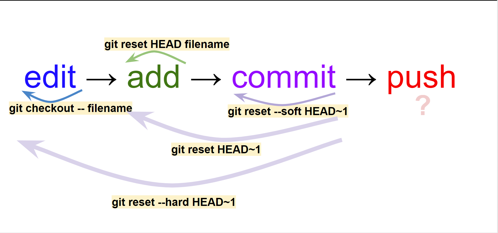

# GitHub Tutorial

by Hengsheng Liu 

---
## Git vs. GitHub
**Git (Local) :** is a local version control system that's installed inside of the IDE(Integrated development environment). It takes snap-shot of your code and record its history so the developer could track the changes and revert it at any time.

**GitHub (Remote):** is a remote server that store the user's code. It is mainly use by developers to collaborate with his/her coworkers. 

**Git Vs. GitHub**

*   Git is a local place that saves code and Github is a remote place that saves the code on a server
*   GitHub does require Git but Git doesn't require GitHub
*   Git is use for track changes and GitHub is used for storage code also visually representation for changes
*   Developers could work together in GitHub and merge to a master branch but Git can't do that. 

---
## Initial Setup

Log into the [Github website](https://github.com/) to create a GitHub accout


Here is a good link of how to connect Github with IDE
[Setup IDE](https://github.com/hstatsep/ide50)

When **forking** or **cloning**, make sure using **SSH** not HTTPS because HTTPS have to check your identity and you have to type password and username everytime. on the other side, **SSH** doesn't require it. 


---
## Repository Setup
When you want initialize Git inside your folder
1. **Git init** - Initilaized Git inside the folder and the folder should change from xxx/xxx to xxx/xxx/(Master)
2. **Git add .** - Add the current working directory to the staging area and you should see something like this
3. Recommend to type **git status** to check the status of the file
4. When you typed in **git status** and the file is ready for committing. Git status will like this
 ```bash
On branch master
Your branch is up to date with 'origin/master'.

Changes to be committed:
  (use "git reset HEAD <file>..." to unstage)

        modified:   README.md

```
 If is not added to the stage, Git Status will show like this
```bash
On branch master
Your branch is up to date with 'origin/master'.

Changes not staged for commit:
  (use "git add <file>..." to update what will be committed)
  (use "git checkout -- <file>..." to discard changes in working directory)

        modified:   README.md

no changes added to commit (use "git add" and/or "git commit -a")
```
5. **Git commit -m "message"** - Take a ‘snapshot’ of the files on the stage.  The message should be present-tense and describe what was modified in this snapshot (‘create HTML template”)
6. Personal choice - could type git status to check again.
7. **Git push** - push the version to a remote server like GitHub. 

## Set up remote
1. **Git remote add origin URL** - Set up connection between local IDE and a remote server. URL = SSH 
2. **Git push -u origin master** - First time pushing the changes to a remote but after the first time you could just type **git push** to push the changes. 
3. **Git remote -v** - could you where is the committs send to. 
```bash
origin  git@github.com:hengshengl7714/github-tutorial.git (fetch)
origin  git@github.com:hengshengl7714/github-tutorial.git (push)
```


---
## Workflow & Commands
**Workflow**
1. editing inside of the repo 
2. type **git status** to see whether the file is modified or not(it should be in red).
3. type **git add .** to add the changes to the stage so the file is ready to commit.
4. type **git status** to see whether the file is added to the stage or not(now it should be green).
5. type **git commit -m "message"** to commit the change and Git will save a record of the change 
6. type **git staus** it should say nothing to commit and say you're ahead of your remote repo x times 

```bash
[master 56c1b57] add workflow
 1 file changed, 8 insertions(+), 2 deletions(-)
~/github-learning/github-tutorial/ (master) $ git status 
On branch master
Your branch is ahead of 'origin/master' by 1 commit.
  (use "git push" to publish your local commits)

nothing to commit, working tree clean
```

7. type **git push** to push the commit to your remote(GitHub).


---
## Rolling Back Changes
**git reset --hard HEAD~1** - Undo all the changes after committed the change.  
**git reset --soft HEAD~1** - Undo the commit after committed the change.  
**git reset HEAD~1** - Undo both the commit and the add after committed the change.  
**git reset HEAD filename** - Undo the adding after added to the stage area.  
**git checkout -- filename** - Undo the all the editing before adding



---
## Error handling 
* How to remove from a directory? -- inside the directory type **rm -rf .git** 
* How to remove a repo locally? -- go to the parent folder of the repo and type **rm -rf [folder name]**
* How to remove a repo remotelly? 
    1. go to your remote website (GitHub) 

