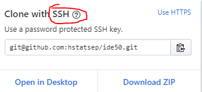

# GitHub Tutorial

by Hengsheng Liu 

---
## Git vs. GitHub
**Git (Local) :** is a local version control system that's installed inside of the IDE(Integrated development environment). It takes snap-shot of your code and record its history so the developer could track the changes and revert it at any time.

**GitHub (Remote):** is a remote server that store the user's code. It is mainly use by developers to collaborate with his/her coworkers. 

**Git Vs. GitHub**

*   Git is a local place that saves code and Github is a remote place that saves the code on a server
*   GitHub does require Git but Git doesn't require GitHub
*   Git is use for track changes and GitHub is used for storage code also visually representation for changes
*   Developers could work together in GitHub and merge to a master branch but Git can't do that. 

---
## Initial Setup

Log into the [Github website](https://github.com/) to create a GitHub accout

Here is a good link of how to connect Github with IDE

When **forking** or **cloning**, make sure using **SSH** not HTTPS because HTTPS have to check your identity and you have to type password and username everytime. on the other side, **SSH** doesn't require it. 

---
## Repository Setup

---
## Workflow & Commands

---
## Rolling Back Changes